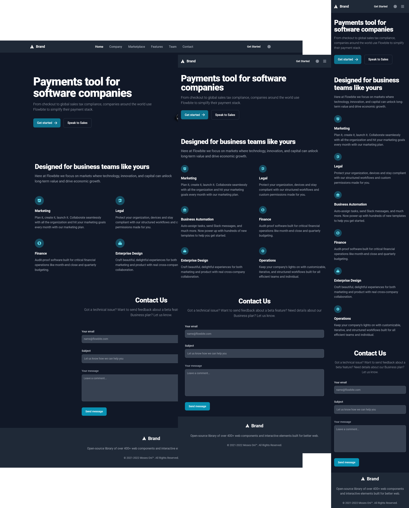
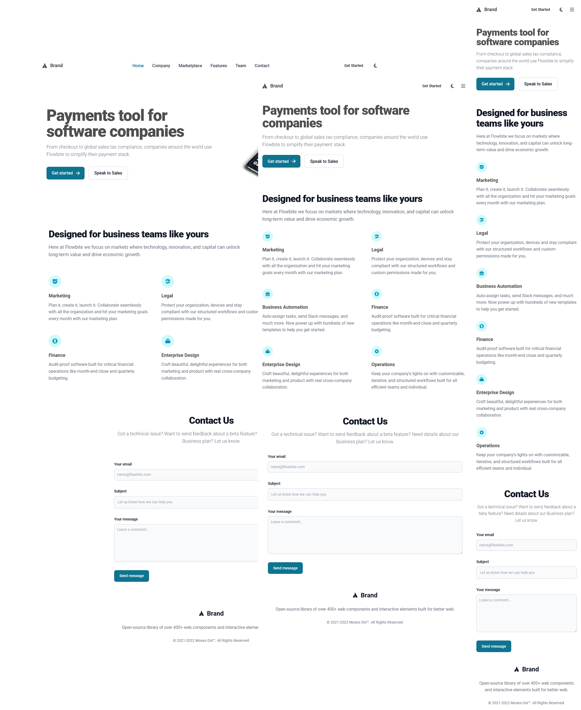

---

# Tailwind Responsive Starter V2.01

  


## File Tree

```
.
├── dark.png
├── index.html
├── light.png
└── README.md
```

---
**Tailwind Responsive Starter V2.01** is a simple HTML template designed for beginners who want to quickly set up a responsive website with Tailwind CSS. This template includes a dark/light theme toggle, a responsive mobile navbar, and basic sections like the header, hero, features, contact, and footer.

## Table of Contents

- [Introduction](#introduction)
- [Installation](#installation)
- [Project Structure](#project-structure)
- [HTML Structure](#html-structure)
  - [Header Section](#header-section)
  - [Hero Section](#hero-section)
  - [Features Section](#features-section)
  - [Contact Section](#contact-section)
  - [Footer Section](#footer-section)
- [CDN Links](#cdn-links)
- [Scripts](#scripts)
- [License](#license)

## Introduction

This project is intended for those new to Tailwind CSS who want a simple, responsive HTML file that includes basic setup and features like theme toggling. The template comes pre-configured with essential CDN links and scripts.

## Installation

### Cloning the Repository

1. Clone the repository to your local machine using the following command:
   ```bash
   git clone https://github.com/codewithmoses/Tailwind-Responsive-Starter-V2.01.git
   ```
2. Navigate to the project directory:
   ```bash
   cd tailwind-responsive-starter-v2.01
   ```
3. Open the project in your favorite code editor.

### Setting Up the Project from Scratch

1. **Create a new HTML file** (e.g., `index.html`) in your project directory.
2. **Add the required CDN links** to the `<head>` section of your HTML file.
3. **Add the HTML structure** for each section (header, hero, features, contact, footer) using the snippets provided below.
4. **Add the necessary scripts** before the closing `</body>` tag.
5. Customize the content as needed.

## Project Structure

Your project structure should look something like this:

```
tailwind-responsive-starter-v2.01/
│
├── index.html
├── README.md
└── LICENSE
```

## HTML Structure

### Header Section

```html
  <!-- Header Navbar Section -->
    <header>
      <nav
        class="bg-white border-gray-200 px-4 lg:px-6 py-2.5 dark:bg-gray-800"
      >
        <div
          class="flex flex-wrap justify-between items-center mx-auto max-w-screen-xl"
        >
          <a href="https://flowbite.com" class="flex items-center">
            <i class="fa-brands fa-atlassian mr-3 text-lg"></i>
            <span
              class="self-center text-lg font-semibold whitespace-nowrap dark:text-white"
              >Brand</span
            >
          </a>
          <div class="flex items-center lg:order-2">
            <a
              href="#"
              class="text-gray-800 dark:text-white hover:bg-gray-50 focus:ring-4 focus:ring-gray-300 font-medium rounded-lg text-sm px-4 lg:px-5 py-2 lg:py-2.5 mr-2 dark:hover:bg-gray-700 focus:outline-none dark:focus:ring-gray-800"
              >Get Started</a
            >

            <button
              id="theme-toggle"
              type="button"
              class="text-gray-500 dark:text-gray-400 text-sm p-2"
            >
              <i
                class="fa-solid fa-moon hidden text-lg p-1"
                id="theme-toggle-light-icon"
              ></i>
              <i
                class="fa-solid fa-sun hidden text-lg"
                id="theme-toggle-dark-icon"
              ></i>
            </button>

            <button
              id="mobile-menu-toggle"
              data-collapse-toggle="mobile-menu-2"
              type="button"
              class="inline-flex items-center p-2.5 ml-1 text-sm text-gray-500 rounded-lg lg:hidden dark:text-gray-400"
              aria-controls="mobile-menu-2"
              aria-expanded="false"
            >
              <span class="sr-only">Open main menu</span>
              <i class="fa-solid fa-bars text-lg" id="menu-icon"></i>
              <i class="fa-solid fa-xmark text-lg hidden" id="close-icon"></i>
            </button>
          </div>
          <div
            class="hidden justify-between items-center w-full lg:flex lg:w-auto lg:order-1"
            id="mobile-menu-2"
          >
            <ul
              class="flex flex-col mt-4 font-medium lg:flex-row lg:space-x-8 lg:mt-0"
            >
              <li>
                <a
                  href="#"
                  class="menu-link block py-2 pr-4 pl-3 text-white rounded bg-cyan-700 lg:bg-transparent lg:text-cyan-700 lg:p-0 dark:text-white"
                  aria-current="page"
                  >Home</a
                >
              </li>
              <li>
                <a
                  href="#"
                  class="menu-link block py-2 pr-4 pl-3 text-gray-700 border-b border-gray-100 hover:bg-gray-50 lg:hover:bg-transparent lg:border-0 lg:hover:text-cyan-700 lg:p-0 dark:text-gray-400 lg:dark:hover:text-white dark:hover:bg-gray-700 dark:hover:text-white lg:dark:hover:bg-transparent dark:border-gray-700"
                  >Company</a
                >
              </li>
              <li>
                <a
                  href="#"
                  class="menu-link block py-2 pr-4 pl-3 text-gray-700 border-b border-gray-100 hover:bg-gray-50 lg:hover:bg-transparent lg:border-0 lg:hover:text-cyan-700 lg:p-0 dark:text-gray-400 lg:dark:hover:text-white dark:hover:bg-gray-700 dark:hover:text-white lg:dark:hover:bg-transparent dark:border-gray-700"
                  >Marketplace</a
                >
              </li>
              <li>
                <a
                  href="#"
                  class="menu-link block py-2 pr-4 pl-3 text-gray-700 border-b border-gray-100 hover:bg-gray-50 lg:hover:bg-transparent lg:border-0 lg:hover:text-cyan-700 lg:p-0 dark:text-gray-400 lg:dark:hover:text-white dark:hover:bg-gray-700 dark:hover:text-white lg:dark:hover:bg-transparent dark:border-gray-700"
                  >Features</a
                >
              </li>
              <li>
                <a
                  href="#"
                  class="menu-link block py-2 pr-4 pl-3 text-gray-700 border-b border-gray-100 hover:bg-gray-50 lg:hover:bg-transparent lg:border-0 lg:hover:text-cyan-700 lg:p-0 dark:text-gray-400 lg:dark:hover:text-white dark:hover:bg-gray-700 dark:hover:text-white lg:dark:hover:bg-transparent dark:border-gray-700"
                  >Team</a
                >
              </li>
              <li>
                <a
                  href="#"
                  class="menu-link block py-2 pr-4 pl-3 text-gray-700 border-b border-gray-100 hover:bg-gray-50 lg:hover:bg-transparent lg:border-0 lg:hover:text-cyan-700 lg:p-0 dark:text-gray-400 lg:dark:hover:text-white dark:hover:bg-gray-700 dark:hover:text-white lg:dark:hover:bg-transparent dark:border-gray-700"
                  >Contact</a
                >
              </li>
            </ul>
          </div>
        </div>
      </nav>
    </header>
```

### Hero Section

```html
  <!-- Hero Section -->
    <section class="bg-white dark:bg-gray-900">
      <div
        class="grid max-w-screen-xl px-4 py-8 mx-auto lg:gap-8 xl:gap-0 lg:py-16 lg:grid-cols-12"
      >
        <div class="mr-auto place-self-center lg:col-span-7">
          <h1
            class="max-w-2xl mb-4 text-4xl font-extrabold tracking-tight leading-none md:text-5xl xl:text-6xl dark:text-white"
          >
            Payments tool for software companies
          </h1>
          <p
            class="max-w-2xl mb-6 font-light text-gray-500 lg:mb-8 md:text-lg lg:text-lg dark:text-gray-400"
          >
            From checkout to global sales tax compliance, companies around the
            world use Flowbite to simplify their payment stack.
          </p>
          <a
            href="#"
            class="inline-flex items-center justify-center px-5 py-3 mr-3 text-base font-medium text-center text-white rounded-lg bg-cyan-700 hover:bg-cyan-800 focus:ring-4 focus:ring-cyan-300 dark:focus:ring-cyan-900"
          >
            Get started
            <svg
              class="w-5 h-5 ml-2 -mr-1"
              fill="currentColor"
              viewBox="0 0 20 20"
              xmlns="http://www.w3.org/2000/svg"
            >
              <path
                fill-rule="evenodd"
                d="M10.293 3.293a1 1 0 011.414 0l6 6a1 1 0 010 1.414l-6 6a1 1 0 01-1.414-1.414L14.586 11H3a1 1 0 110-2h11.586l-4.293-4.293a1 1 0 010-1.414z"
                clip-rule="evenodd"
              ></path>
            </svg>
          </a>
          <a
            href="#"
            class="inline-flex items-center justify-center px-5 py-3 text-base font-medium text-center text-gray-900 border border-gray-300 rounded-lg hover:bg-gray-100 focus:ring-4 focus:ring-gray-100 dark:text-white dark:border-gray-700 dark:hover:bg-gray-700 dark:focus:ring-gray-800"
          >
            Speak to Sales
          </a>
        </div>
        <div class="hidden lg:mt-0 lg:col-span-5 lg:flex">
          
        </div>
      </div>
    </section>
```

### Features Section

```html
   <!-- Features Section -->
    <section class="bg-white dark:bg-gray-900">
      <div class="py-8 px-4 mx-auto max-w-screen-xl sm:py-16 lg:px-6">
        <div class="max-w-screen-md mb-8 lg:mb-16">
          <h2
            class="mb-4 text-4xl tracking-tight font-extrabold text-gray-900 dark:text-white"
          >
            Designed for business teams like yours
          </h2>
          <p class="text-gray-500 sm:text-lg dark:text-gray-400">
            Here at Flowbite we focus on markets where technology, innovation,
            and capital can unlock long-term value and drive economic growth.
          </p>
        </div>
        <div
          class="space-y-8 md:grid md:grid-cols-2 lg:grid-cols-3 md:gap-12 md:space-y-0"
        >
          <div>
            <div
              class="flex justify-center items-center mb-4 w-10 h-10 rounded-full bg-cyan-100 lg:h-12 lg:w-12 dark:bg-cyan-900"
            >
              <svg
                class="w-5 h-5 text-cyan-600 lg:w-6 lg:h-6 dark:text-cyan-300"
                fill="currentColor"
                viewBox="0 0 20 20"
                xmlns="http://www.w3.org/2000/svg"
              >
                <path
                  fill-rule="evenodd"
                  d="M3 3a1 1 0 000 2v8a2 2 0 002 2h2.586l-1.293 1.293a1 1 0 101.414 1.414L10 15.414l2.293 2.293a1 1 0 001.414-1.414L12.414 15H15a2 2 0 002-2V5a1 1 0 100-2H3zm11.707 4.707a1 1 0 00-1.414-1.414L10 9.586 8.707 8.293a1 1 0 00-1.414 0l-2 2a1 1 0 101.414 1.414L8 10.414l1.293 1.293a1 1 0 001.414 0l4-4z"
                  clip-rule="evenodd"
                ></path>
              </svg>
            </div>
            <h3 class="mb-2 text-lg font-bold dark:text-white">Marketing</h3>
            <p class="text-gray-500 dark:text-gray-400">
              Plan it, create it, launch it. Collaborate seamlessly with all the
              organization and hit your marketing goals every month with our
              marketing plan.
            </p>
          </div>
          <div>
            <div
              class="flex justify-center items-center mb-4 w-10 h-10 rounded-full bg-cyan-100 lg:h-12 lg:w-12 dark:bg-cyan-900"
            >
              <svg
                class="w-5 h-5 text-cyan-600 lg:w-6 lg:h-6 dark:text-cyan-300"
                fill="currentColor"
                viewBox="0 0 20 20"
                xmlns="http://www.w3.org/2000/svg"
              >
                <path
                  d="M10.394 2.08a1 1 0 00-.788 0l-7 3a1 1 0 000 1.84L5.25 8.051a.999.999 0 01.356-.257l4-1.714a1 1 0 11.788 1.838L7.667 9.088l1.94.831a1 1 0 00.787 0l7-3a1 1 0 000-1.838l-7-3zM3.31 9.397L5 10.12v4.102a8.969 8.969 0 00-1.05-.174 1 1 0 01-.89-.89 11.115 11.115 0 01.25-3.762zM9.3 16.573A9.026 9.026 0 007 14.935v-3.957l1.818.78a3 3 0 002.364 0l5.508-2.361a11.026 11.026 0 01.25 3.762 1 1 0 01-.89.89 8.968 8.968 0 00-5.35 2.524 1 1 0 01-1.4 0zM6 18a1 1 0 001-1v-2.065a8.935 8.935 0 00-2-.712V17a1 1 0 001 1z"
                ></path>
              </svg>
            </div>
            <h3 class="mb-2 text-lg font-bold dark:text-white">Legal</h3>
            <p class="text-gray-500 dark:text-gray-400">
              Protect your organization, devices and stay compliant with our
              structured workflows and custom permissions made for you.
            </p>
          </div>
          <div>
            <div
              class="flex justify-center items-center mb-4 w-10 h-10 rounded-full bg-cyan-100 lg:h-12 lg:w-12 dark:bg-cyan-900"
            >
              <svg
                class="w-5 h-5 text-cyan-600 lg:w-6 lg:h-6 dark:text-cyan-300"
                fill="currentColor"
                viewBox="0 0 20 20"
                xmlns="http://www.w3.org/2000/svg"
              >
                <path
                  fill-rule="evenodd"
                  d="M6 6V5a3 3 0 013-3h2a3 3 0 013 3v1h2a2 2 0 012 2v3.57A22.952 22.952 0 0110 13a22.95 22.95 0 01-8-1.43V8a2 2 0 012-2h2zm2-1a1 1 0 011-1h2a1 1 0 011 1v1H8V5zm1 5a1 1 0 011-1h.01a1 1 0 110 2H10a1 1 0 01-1-1z"
                  clip-rule="evenodd"
                ></path>
                <path
                  d="M2 13.692V16a2 2 0 002 2h12a2 2 0 002-2v-2.308A24.974 24.974 0 0110 15c-2.796 0-5.487-.46-8-1.308z"
                ></path>
              </svg>
            </div>
            <h3 class="mb-2 text-lg font-bold dark:text-white">
              Business Automation
            </h3>
            <p class="text-gray-500 dark:text-gray-400">
              Auto-assign tasks, send Slack messages, and much more. Now power
              up with hundreds of new templates to help you get started.
            </p>
          </div>
          <div>
            <div
              class="flex justify-center items-center mb-4 w-10 h-10 rounded-full bg-cyan-100 lg:h-12 lg:w-12 dark:bg-cyan-900"
            >
              <svg
                class="w-5 h-5 text-cyan-600 lg:w-6 lg:h-6 dark:text-cyan-300"
                fill="currentColor"
                viewBox="0 0 20 20"
                xmlns="http://www.w3.org/2000/svg"
              >
                <path
                  d="M8.433 7.418c.155-.103.346-.196.567-.267v1.698a2.305 2.305 0 01-.567-.267C8.07 8.34 8 8.114 8 8c0-.114.07-.34.433-.582zM11 12.849v-1.698c.22.071.412.164.567.267.364.243.433.468.433.582 0 .114-.07.34-.433.582a2.305 2.305 0 01-.567.267z"
                ></path>
                <path
                  fill-rule="evenodd"
                  d="M10 18a8 8 0 100-16 8 8 0 000 16zm1-13a1 1 0 10-2 0v.092a4.535 4.535 0 00-1.676.662C6.602 6.234 6 7.009 6 8c0 .99.602 1.765 1.324 2.246.48.32 1.054.545 1.676.662v1.941c-.391-.127-.68-.317-.843-.504a1 1 0 10-1.51 1.31c.562.649 1.413 1.076 2.353 1.253V15a1 1 0 102 0v-.092a4.535 4.535 0 001.676-.662C13.398 13.766 14 12.991 14 12c0-.99-.602-1.765-1.324-2.246A4.535 4.535 0 0011 9.092V7.151c.391.127.68.317.843.504a1 1 0 101.511-1.31c-.563-.649-1.413-1.076-2.354-1.253V5z"
                  clip-rule="evenodd"
                ></path>
              </svg>
            </div>
            <h3 class="mb-2 text-lg font-bold dark:text-white">Finance</h3>
            <p class="text-gray-500 dark:text-gray-400">
              Audit-proof software built for critical financial operations like
              month-end close and quarterly budgeting.
            </p>
          </div>
          <div>
            <div
              class="flex justify-center items-center mb-4 w-10 h-10 rounded-full bg-cyan-100 lg:h-12 lg:w-12 dark:bg-cyan-900"
            >
              <svg
                class="w-5 h-5 text-cyan-600 lg:w-6 lg:h-6 dark:text-cyan-300"
                fill="currentColor"
                viewBox="0 0 20 20"
                xmlns="http://www.w3.org/2000/svg"
              >
                <path
                  d="M7 3a1 1 0 000 2h6a1 1 0 100-2H7zM4 7a1 1 0 011-1h10a1 1 0 110 2H5a1 1 0 01-1-1zM2 11a2 2 0 012-2h12a2 2 0 012 2v4a2 2 0 01-2 2H4a2 2 0 01-2-2v-4z"
                ></path>
              </svg>
            </div>
            <h3 class="mb-2 text-lg font-bold dark:text-white">
              Enterprise Design
            </h3>
            <p class="text-gray-500 dark:text-gray-400">
              Craft beautiful, delightful experiences for both marketing and
              product with real cross-company collaboration.
            </p>
          </div>
          <div>
            <div
              class="flex justify-center items-center mb-4 w-10 h-10 rounded-full bg-cyan-100 lg:h-12 lg:w-12 dark:bg-cyan-900"
            >
              <svg
                class="w-5 h-5 text-cyan-600 lg:w-6 lg:h-6 dark:text-cyan-300"
                fill="currentColor"
                viewBox="0 0 20 20"
                xmlns="http://www.w3.org/2000/svg"
              >
                <path
                  fill-rule="evenodd"
                  d="M11.49 3.17c-.38-1.56-2.6-1.56-2.98 0a1.532 1.532 0 01-2.286.948c-1.372-.836-2.942.734-2.106 2.106.54.886.061 2.042-.947 2.287-1.561.379-1.561 2.6 0 2.978a1.532 1.532 0 01.947 2.287c-.836 1.372.734 2.942 2.106 2.106a1.532 1.532 0 012.287.947c.379 1.561 2.6 1.561 2.978 0a1.533 1.533 0 012.287-.947c1.372.836 2.942-.734 2.106-2.106a1.533 1.533 0 01.947-2.287c1.561-.379 1.561-2.6 0-2.978a1.532 1.532 0 01-.947-2.287c.836-1.372-.734-2.942-2.106-2.106a1.532 1.532 0 01-2.287-.947zM10 13a3 3 0 100-6 3 3 0 000 6z"
                  clip-rule="evenodd"
                ></path>
              </svg>
            </div>
            <h3 class="mb-2 text-lg font-bold dark:text-white">Operations</h3>
            <p class="text-gray-500 dark:text-gray-400">
              Keep your company’s lights on with customizable, iterative, and
              structured workflows built for all efficient teams and individual.
            </p>
          </div>
        </div>
      </div>
    </section>
```

### Contact Section

```html
   <!-- Contact Section -->
    <section class="bg-white dark:bg-gray-900">
      <div class="py-8 lg:py-16 px-4 mx-auto max-w-screen-md">
        <h2
          class="mb-4 text-4xl tracking-tight font-extrabold text-center text-gray-900 dark:text-white"
        >
          Contact Us
        </h2>
        <p
          class="mb-8 lg:mb-16 font-light text-center text-gray-500 dark:text-gray-400 sm:text-lg"
        >
          Got a technical issue? Want to send feedback about a beta feature?
          Need details about our Business plan? Let us know.
        </p>
        <form action="#" class="space-y-8">
          <div>
            <label
              for="email"
              class="block mb-2 text-sm font-medium text-gray-900 dark:text-gray-300"
              >Your email</label
            >
            <input
              type="email"
              id="email"
              class="shadow-sm bg-gray-50 border border-gray-300 text-gray-900 text-sm rounded-lg focus:ring-cyan-500 focus:border-cyan-500 block w-full p-2.5 dark:bg-gray-700 dark:border-gray-600 dark:placeholder-gray-400 dark:text-white dark:focus:ring-cyan-500 dark:focus:border-cyan-500 dark:shadow-sm-light"
              placeholder="name@flowbite.com"
              required
            />
          </div>
          <div>
            <label
              for="subject"
              class="block mb-2 text-sm font-medium text-gray-900 dark:text-gray-300"
              >Subject</label
            >
            <input
              type="text"
              id="subject"
              class="block p-3 w-full text-sm text-gray-900 bg-gray-50 rounded-lg border border-gray-300 shadow-sm focus:ring-cyan-500 focus:border-cyan-500 dark:bg-gray-700 dark:border-gray-600 dark:placeholder-gray-400 dark:text-white dark:focus:ring-cyan-500 dark:focus:border-cyan-500 dark:shadow-sm-light"
              placeholder="Let us know how we can help you"
              required
            />
          </div>
          <div class="sm:col-span-2">
            <label
              for="message"
              class="block mb-2 text-sm font-medium text-gray-900 dark:text-gray-400"
              >Your message</label
            >
            <textarea
              id="message"
              rows="6"
              class="block p-2.5 w-full text-sm text-gray-900 bg-gray-50 rounded-lg shadow-sm border border-gray-300 focus:ring-cyan-500 focus:border-cyan-500 dark:bg-gray-700 dark:border-gray-600 dark:placeholder-gray-400 dark:text-white dark:focus:ring-cyan-500 dark:focus:border-cyan-500"
              placeholder="Leave a comment..."
            ></textarea>
          </div>
          <button
            type="submit"
            class="py-3 px-5 text-sm font-medium text-center text-white rounded-lg bg-cyan-700 sm:w-fit hover:bg-cyan-800 focus:ring-4 focus:outline-none focus:ring-cyan-300 dark:bg-cyan-600 dark:hover:bg-cyan-700 dark:focus:ring-cyan-800"
          >
            Send message
          </button>
        </form>
      </div>
    </section>
```

### Footer Section

```html
   <!-- Footer Section -->
    <footer class="p-4 bg-white md:p-8 lg:p-10 dark:bg-gray-800">
      <div class="mx-auto max-w-screen-xl text-center">
        <a
          href="#"
          class="flex justify-center items-center text-2xl font-semibold text-gray-900 dark:text-white"
        >
          <i class="fa-brands fa-atlassian text-lg mr-3"></i> Brand
        </a>
        <p class="my-6 text-gray-500 dark:text-gray-400">
          Open-source library of over 400+ web components and interactive
          elements built for better web.
        </p>

        <span class="text-sm text-gray-500 sm:text-center dark:text-gray-400"
          >© 2021-2022 <a href="#" class="hover:underline">Moses Oni™</a>. All
          Rights Reserved.</span
        >
      </div>
    </footer>
```

## CDN Links

Add the following CDN links to the `<head>` section of your HTML file:

1. **Tailwind CSS:**
   ```html
   <script src="https://cdn.tailwindcss.com/3.3.0"></script>
   ```
   **Tailwind Config:**
   ```html
   <script>
      tailwind.config = {
        darkMode: "class",
        theme: {
          fontFamily: {
            sans: ["Roboto", "sans-serif"],
          },
        },
        corePlugins: {
          preflight: false,
        },
      };
    </script>
   ```

2. **Tailwind TW Element:**
   ```html
   <link rel="stylesheet" href="https://cdn.jsdelivr.net/npm/tw-elements/css/tw-elements.min.css">
   ```

3. **Font Awesome CDN:**
   ```html
   <link rel="stylesheet" href="https://cdnjs.cloudflare.com/ajax/libs/font-awesome/6.6.0/css/all.min.css" integrity="sha512-Kc323vGBEqzTmouAECnVceyQqyqdsSiqLQISBL29aUW4U/M7pSPA/gEUZQqv1cwx4OnYxTxve5UMg5GT6L4JJg==" crossorigin="anonymous" referrerpolicy="no-referrer" />
   ```

4. **Google Roboto Font:**
   ```html
   <link rel="preconnect" href="https://fonts.googleapis.com" />
   <link rel="preconnect" href="https://fonts.gstatic.com" crossorigin />
   <link href="https://fonts.googleapis.com/css2?family=Roboto:ital,wght@0,100;0,300;0,400;0,500;0,700;0,900;1,100;1,300;1,400;1,500;1,700;1,900&display=swap" rel="stylesheet" />
   ```

## Scripts

Add the following scripts before the closing `</body>` tag of your HTML file:

1. **Theme Toggle and Responsive Mobile Navbar Script:**
   ```html
   <script>
      const themeToggleBtn = document.getElementById("theme-toggle");
      const darkIcon = document.getElementById("theme-toggle-dark-icon");
      const lightIcon = document.getElementById("theme-toggle-light-icon");

      if (
        localStorage.getItem("color-theme") === "dark" ||
        (!localStorage.getItem("color-theme") &&
          window.matchMedia("(prefers-color-scheme: dark)").matches)
      ) {
        document.documentElement.classList.add("dark");
        darkIcon.classList.remove("hidden");
      } else {
        document.documentElement.classList.remove("dark");
        lightIcon.classList.remove("hidden");
      }

      themeToggleBtn.addEventListener("click", function () {
        darkIcon.classList.toggle("hidden");
        lightIcon.classList.toggle("hidden");

        if (localStorage.getItem("color-theme")) {
          if (localStorage.getItem("color-theme") === "light") {
            document.documentElement.classList.add("dark");
            localStorage.setItem("color-theme", "dark");
          } else {
            document.documentElement.classList.remove("dark");
            localStorage.setItem("color-theme", "light");
          }
        } else {
          if (document.documentElement.classList.contains("dark")) {
            document.documentElement.classList.remove("dark");
            localStorage.setItem("color-theme", "light");
          } else {
            document.documentElement.classList.add("dark");
            localStorage.setItem("color-theme", "dark");
          }
        }
      });

      // Mobile menu toggle script
      const mobileMenuToggle = document.getElementById("mobile-menu-toggle");
      const mobileMenu = document.getElementById("mobile-menu-2");
      const menuIcon = document.getElementById("menu-icon");
      const closeIcon = document.getElementById("close-icon");
      const menuLinks = document.querySelectorAll(".menu-link");

      mobileMenuToggle.addEventListener("click", () => {
        mobileMenu.classList.toggle("hidden");
        menuIcon.classList.toggle("hidden");
        closeIcon.classList.toggle("hidden");
      });

      menuLinks.forEach((link) => {
        link.addEventListener("click", () => {
          mobileMenu.classList.add("hidden");
          menuIcon.classList.remove("hidden");
          closeIcon.classList.add("hidden");
        });
      });
    </script>
   ```

2. **TW Elements JS Script:**
   ```html
   <script src="https://cdn.jsdelivr.net/npm/tw-elements/js/tw-elements.umd.min.js"></script>
   ```

3. **Font Awesome JS Script:**
   ```html
   <script src="https://kit.fontawesome.com/a076d05399.js" crossorigin="anonymous"></script>
   ```

## License

This project is licensed under the MIT License - see the [LICENSE](LICENSE) file for details.

---
